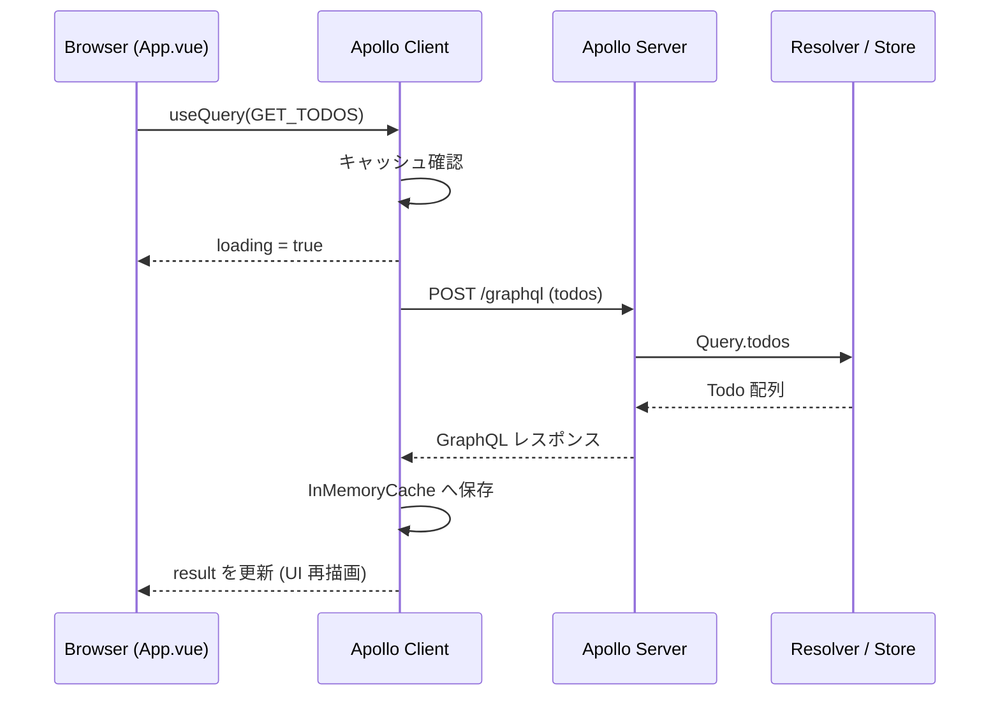
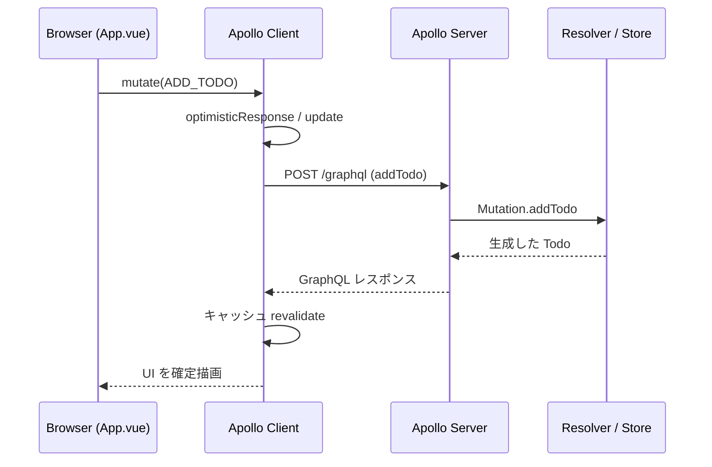

# フロー解説

## 目的
- Vue コンポーネントの操作がどのように GraphQL リクエストへ変換され、Apollo Server の resolver を経由して UI を更新するかを俯瞰します。
- 初学者が「ボタン操作 → 通信 → 画面更新」の往復をイメージできるよう、ストーリー形式で説明します。

## 基本の流れ
1. ユーザーが Todo 画面 (App.vue) 上で操作する。
2. Composition API の `useQuery` / `useMutation` が GraphQL ドキュメントを読み込み、Apollo Client に命令を送る。
3. Apollo Client が HTTP POST (`/graphql`) を発行し、必要に応じて InMemoryCache を参照する。
4. Apollo Server の resolver がメモリ上の Todo ストアを読み書きし、レスポンスを返す。
5. Apollo Client がレスポンスをキャッシュへ反映し、Vue のリアクティブシステムが UI を再描画する。

## 画面操作ごとのシナリオ
### Todo 追加 (`ADD_TODO`)
1. フォームの入力値を `addTodo` へ渡し、`useMutation` の `mutate` を実行。
2. Optimistic UI を設定する場合は `optimisticResponse` で即時に一覧へ追加。
3. サーバー側 `Mutation.addTodo` が新しい Todo をストアに push し、作成したオブジェクトを返す。
4. Apollo Client がキャッシュを更新し、`GET_TODOS` を購読中のコンポーネントへ再通知。

### Todo 状態切り替え (`TOGGLE_TODO`)
1. チェックボックス操作で `toggleTodo` を呼び出し、対象 ID を渡す。
2. サーバーの `Mutation.toggleTodo` が `done` フラグを反転し、更新済み Todo を返却。
3. クライアントは `update` フックや `refetchQueries` で一覧を再取得し、最新状態を表示。

### Todo 削除 (`DELETE_TODO`)
1. ゴミ箱アイコンのクリックで `deleteTodo` を実行し、対象 ID を送信。
2. Optimistic UI を併用する場合は、削除対象をキャッシュから即座に取り除く。
3. サーバーの `Mutation.deleteTodo` がストアから要素を除去し、削除した ID を返す。
4. クライアントがキャッシュを同期させ、空欄が発生しないよう一覧を再構築。

## クライアント側のポイント
- **キャッシュ運用**: `InMemoryCache` が Query 結果を保持。`update` / `refetchQueries` / `optimisticResponse` を組み合わせると体感が滑らかになります。
- **リアクティブ更新**: `useQuery` の戻り値 (`result`, `loading`, `error`) は Vue のリアクティブ変数なので、単純なバインディングで UI が自動更新されます。
- **ID の一意性**: Cache の整合性を保つため、`typePolicies` の `keyFields` を変更した場合は resolver 側も合わせて調整します。

## エラー / リカバリ
- `useQuery` / `useMutation` の `error` を監視し、UI ではメッセージとリトライ導線を用意します。
- ネットワークエラー時は `refetch()` を提供し、ユーザーが手動で再実行できるようにします。
- サーバーで例外が発生した場合は GraphQL エラーとして返るため、ブラウザコンソールとサーバーログの両方を確認してください。

## シーケンス図
### 初回ロード (`GET_TODOS`)

### Todo 追加 (`ADD_TODO`)

## 参考
- GraphQL の用語確認は `docs/使用ツール.md` 内の「参照しやすい用語メモ」を参照してください。
- Docker Compose 経由でも同じフローが成立しますが、URL は `http://server:4000/graphql` に切り替わります。
